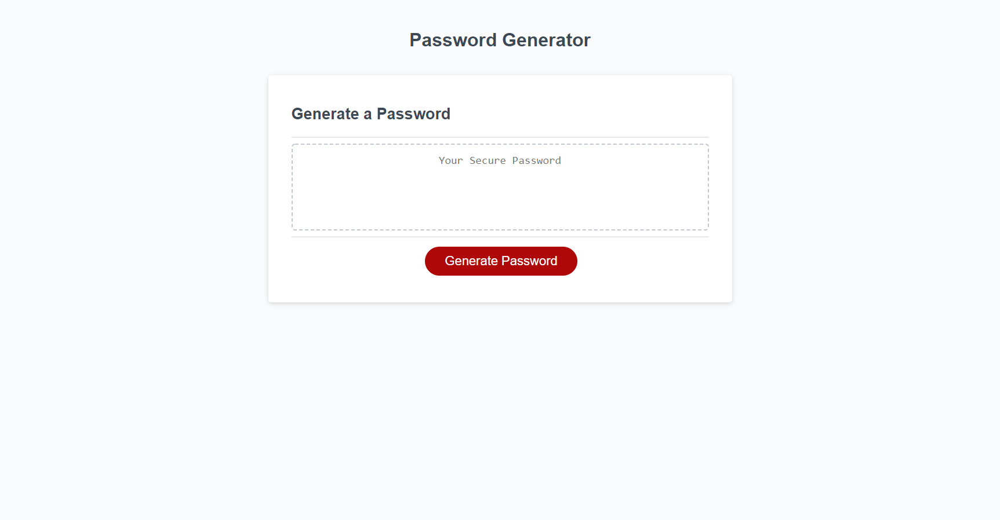

# Password-Generator

This password generator allows employees to generate a random password based on criteria that they've selected and will use at least one of the criteria that they selected.

```
The user will be prompted for the length of anywhere between 8 to 128 characters.
Then, it would go through the criteria that user would like between uppercase letters, lowercase letters, numbers, and special characters.
Input will be validated once all prompts are answered and confirmed.
Finally, the password will generate based on the selected criteria and displayed within the dotted lines.
```

https://github.com/yoojeenkim/Password-Generator
https://yoojeenkim.github.io/Password-Generator/

